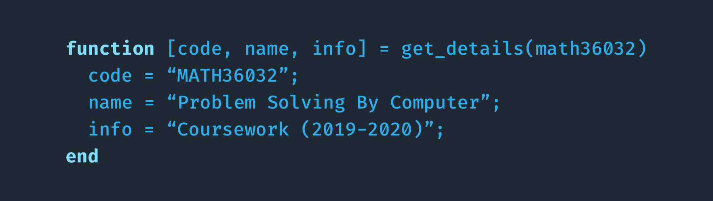

### About
🎲 Repository for my MATH36032 - Problem Solving By Computer coursework (2019-2020).

### Project 1 - Three Short Questions
- [Question 1: Cubic Taxicab Number](ex1/ex1)
- [Question 2: Catalan's Constant](ex1/ex2)
- [Question 3: Sum of Reciprocal Squares with Prime Factors](ex1/ex3)
- [Report for Project 1](ex1/report)

### Project 2 - Projectile Motion
- [Source Code](ex2/src)
- [Report for Project 2](ex2/report)
